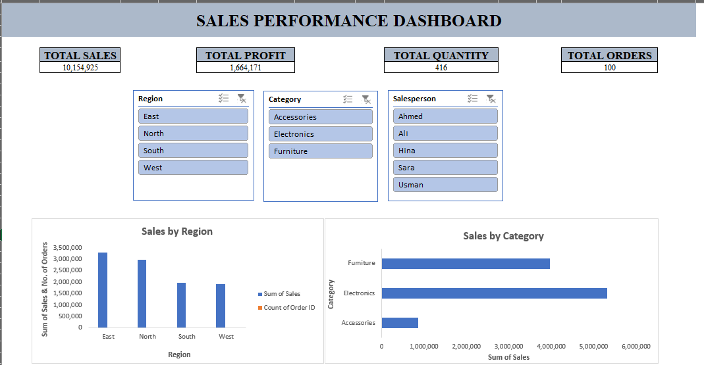
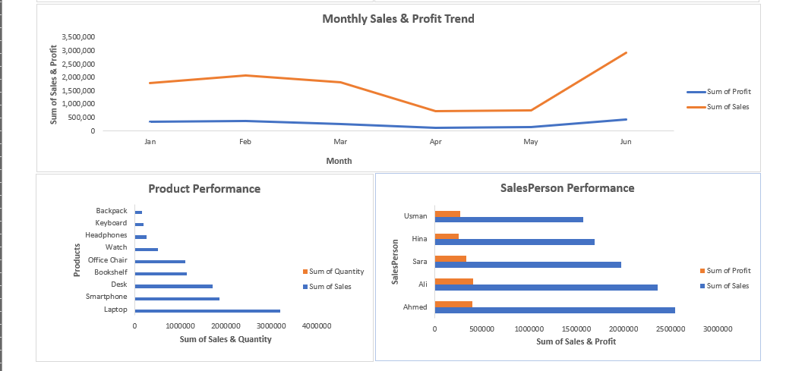
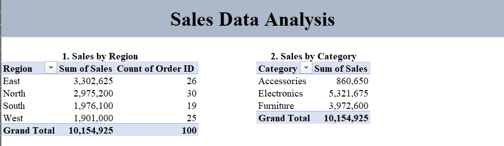
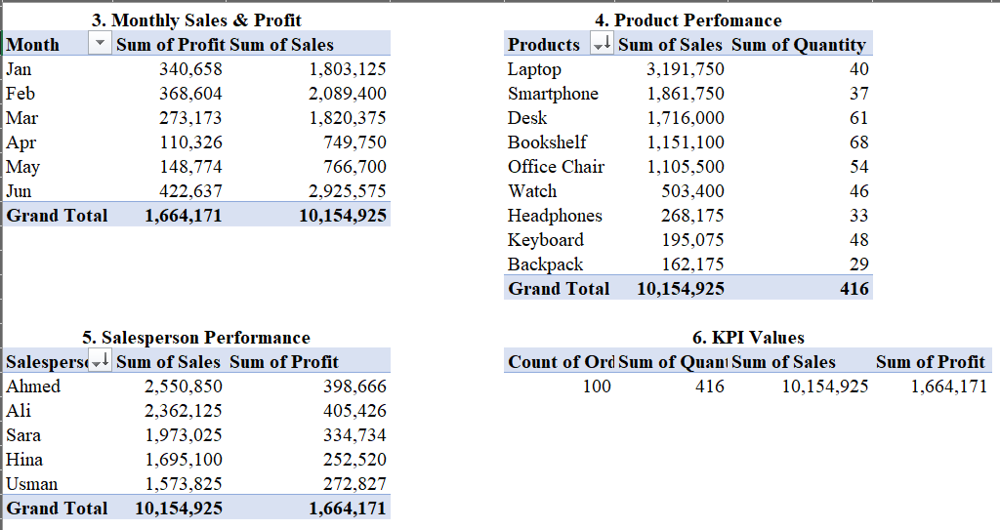
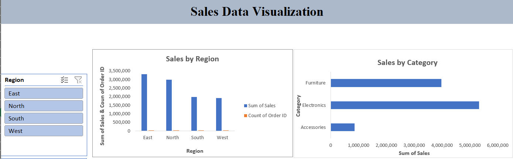
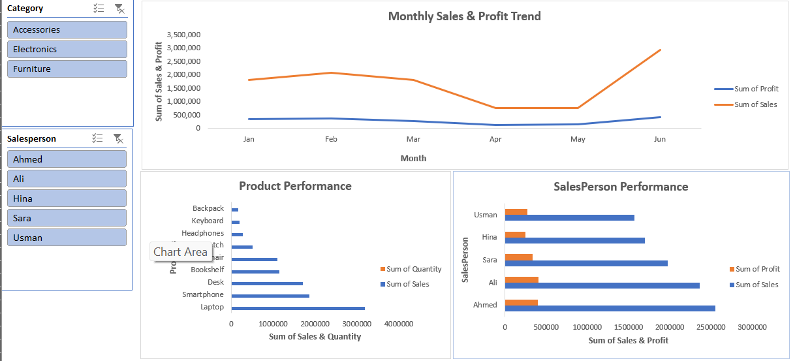

# Interactive Sales Performance Dashboard — Excel

##  Project Overview

This project is an interactive Sales Performance Dashboard built using Microsoft Excel. The dashboard transforms sales data into an easy-to-understand visual report that helps analyze sales, profit, quantity, orders, products, regions, categories, and salesperson performance.

The project demonstrates practical Excel skills used in data analysis, including data preparation, Pivot Tables, Pivot Charts, Slicers, calculated fields, KPI development, and dashboard design.

##  Project Objectives

* Analyze overall sales and profitability
* Compare sales performance across regions
* Analyze sales by product category
* Track monthly sales and profit trends
* Identify high-performing products
* Compare salesperson performance
* Create an interactive dashboard using slicers and dynamic KPIs

##  Tools & Excel Features

* Microsoft Excel
* Excel Tables
* Pivot Tables
* Pivot Charts
* Slicers
* Conditional Formatting
* Data Validation
* Calculated Fields
* KPI Cards
* Dashboard Design
* Basic descriptive statistics

##  Dashboard KPIs

The dashboard includes four interactive Key Performance Indicators:

* **Total Sales**
* **Total Profit**
* **Total Quantity**
* **Total Orders**

These KPIs update dynamically when filters are applied through the dashboard slicers.

##  Analysis Performed

### Sales by Region

Compared sales performance across North, South, East, and West regions.

### Sales by Category

Analyzed sales across Electronics, Furniture, and Accessories.

### Monthly Sales & Profit Trend

Analyzed sales and profit from January to June 2026 to identify monthly performance patterns.

### Product Performance

Compared products based on sales and quantity to identify stronger-performing products.

### Salesperson Performance

Compared sales and profit generated by different salespeople.

##  Interactive Features

The dashboard contains three slicers:

* Region
* Category
* Salesperson

Users can select one or multiple filters and the dashboard updates the connected KPIs, Pivot Tables, and charts.

##  Key Learning Outcomes

Through this project, I practiced:

* Structuring sales data for analysis
* Building Pivot Tables for business questions
* Creating interactive Pivot Charts
* Connecting multiple Pivot Tables to Slicers
* Building dynamic KPI cards
* Designing an interactive Excel dashboard
* Performing final data and dashboard quality checks
* Presenting analytical work in a portfolio-ready format

##  Project Preview

### Dashboard

### Analysis

### Visualization

##  Future Improvements

Possible future improvements include:

* Adding more advanced Excel analytics
* Introducing additional business KPIs
* Adding automated reporting features
* Recreating the dashboard using Power BI
* Connecting the analysis to larger datasets

**Project:** Interactive Sales Performance Dashboard

**Tool:** Microsoft Excel

**Focus:** Sales & Business Data Analysis

## Author
Aleeza Habib
